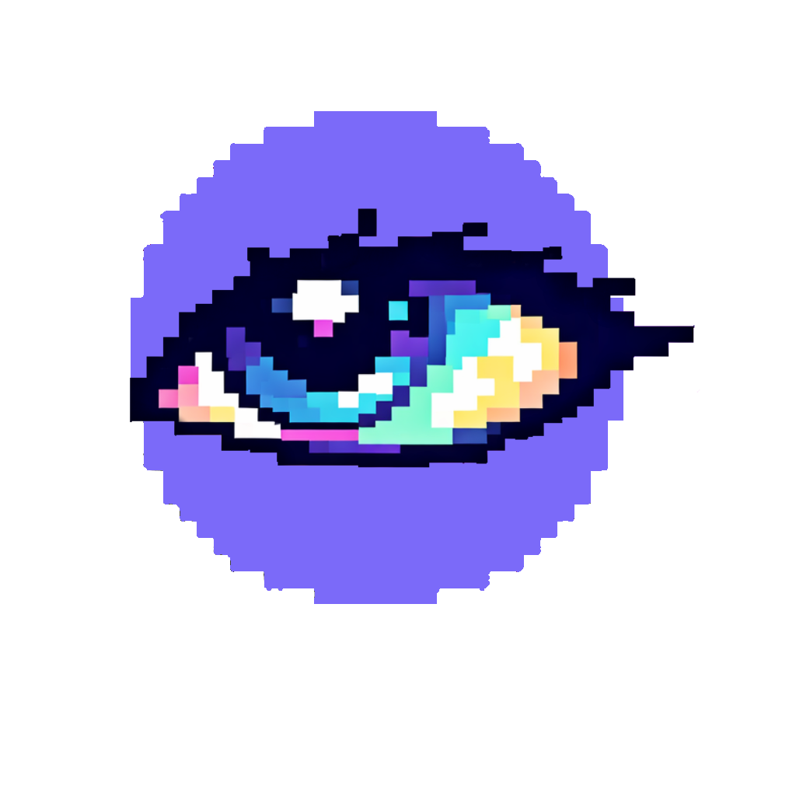

<p align="center">
  
</p>

<h1 align="center">Iris</h1>

<p align="center">
Multi-camera, multi-sensor experiment capture platform for movement science research.<br>
Full-screen desktop GUI with synchronized video, audio, heart rate, and GoPro recording.
</p>

---

## Overview

Iris is a desktop application built for running structured, multi-phase Taekwondo (and general movement science) experiments. It orchestrates synchronized capture across USB cameras, GoPro action cameras, a Polar H10 heart rate monitor, and a USB microphone — all controlled through a single full-screen GUI.

The experimenter is guided through a 7-phase workflow with checklist-gated phase advancement, real-time device status monitoring, integrated video playback for participant self-review and self-scoring, and automated post-processing with heart rate overlays.

Every session produces a `sync_manifest.json` that records wall-clock timestamps for every key event, enabling precise cross-device synchronization in post-processing.

## Key Features

- **Full-screen GUI** — dark-mode CustomTkinter interface with tabbed configuration (Experiment, Devices, Phases, Calibration)
- **7-phase experiment workflow** — setup, HR connection, warmup/calibration, performance, narrating review, self-scoring, finish
- **Checklist-gated advancement** — configurable per-phase requirements that must be checked before the experimenter can proceed
- **Synchronized multi-device capture** — overhead camera, face camera, microphone, Polar H10 HR/ECG, and dual GoPros
- **Integrated video player** — plays back overhead footage for participant narrating review (with pause/resume) and self-scoring
- **Real-time device status panel** — live pass/fail indicators for every connected device
- **Heart rate monitoring** — continuous BPM + RR intervals + optional 130 Hz ECG via Bluetooth LE, phase-labeled
- **Automated post-processing** — composited review video with audio commentary, HR-overlay face videos via ffmpeg
- **Synchronization manifest** — `sync_manifest.json` with microsecond-precision Unix timestamps for every recording start/stop, phase transition, and device event
- **Multi-camera calibration** — intrinsic and extrinsic checkerboard calibration pipeline with stereo calibration
- **GoPro lens correction** — barrel distortion removal for Hero 7 Silver / Hero 5 Session footage
- **Automatic backup** — copies session data to a backup drive on experiment completion

## Hardware

| Device | Quantity | Connection | Purpose |
|--------|----------|------------|---------|
| Logitech USB webcam (1080p/30fps) | 2 | USB | Overhead + face camera |
| GoPro Hero 7 Silver / Hero 5 Session | 2 | WiFi (via USB WiFi adapters) | Wide-angle multi-view capture |
| Polar H10 chest strap | 1 | Bluetooth LE | Heart rate + RR intervals + ECG |
| USB microphone (Tonor or similar) | 1 | USB | Voice commentary and scoring audio |
| Windows 11 PC | 1 | — | Runs Iris |

## Experiment Phases

| # | Phase | What Happens | Checklist-Gated |
|---|-------|-------------|-----------------|
| 1 | **Setup** | Create session directories, display project name | — |
| 2 | **Heart Rate Start** | Connect Polar H10, begin HR recording | — |
| 3 | **Warmup & Calibration** | Open cameras, assign roles, start overhead recording, start GoPros, checkerboard calibration | 7 items |
| 4 | **Performance** | Record overhead + GoPros while participant performs | 2 items |
| 5 | **Narrating Review** | Play back overhead video; participant narrates with pause/resume; face cam + mic record | — |
| 6 | **Self-Scoring** | Play back overhead video (no pause); participant scores; face cam + mic record | — |
| 7 | **Finish** | Post-processing (compositing, HR overlays), experimenter confirms HR stop | 1 item |

## Session Output

Each experiment session produces a timestamped directory:

```
Session_Name_20260222_143012/
├── sync_manifest.json            # Master synchronization file
├── performance/
│   └── overhead_camera.mp4       # Overhead USB camera recording
├── review/
│   ├── face_cam.mp4              # Face camera (pausable)
│   ├── audio_commentary.wav      # Microphone audio
│   └── review_timestamps.json    # Pause/resume wall-clock markers
├── scoring/
│   ├── face_cam.mp4              # Face camera (continuous)
│   └── audio_scoring.wav         # Microphone audio
├── heart_rate/
│   ├── hr_full_session.csv       # HR + RR intervals (phase-labeled)
│   └── ecg_full_session.csv      # Raw ECG at 130 Hz (if enabled)
├── gopro_footage/                # Manually copied GoPro files
├── composited/
│   ├── overhead_with_commentary.mp4
│   ├── review_face_with_hr.mp4
│   └── scoring_face_with_hr.mp4
└── calibration/
```

## Project Structure

```
Iris/
├── gui.py                        # Full-screen desktop GUI (CustomTkinter)
├── main.py                       # CLI entry point
├── Iris.pyw                      # Windows double-click launcher
├── settings.json                 # Experiment configuration
├── requirements.txt              # Python dependencies
├── logo.png                      # Application icon
├── src/
│   ├── experiment.py             # Experiment state machine and phase handlers
│   ├── camera.py                 # USB camera interface (OpenCV)
│   ├── video_recorder.py         # Video recording with pausable support
│   ├── video_player.py           # Threaded video playback engine
│   ├── audio.py                  # Audio recording (soundfile/sounddevice)
│   ├── gopro.py                  # GoPro WiFi control (goprocam)
│   ├── heart_rate.py             # Polar H10 BLE HR + ECG (bleak)
│   ├── compositing.py            # ffmpeg-based video compositing and HR overlay
│   ├── extrinsic_calibration.py  # Multi-camera stereo calibration pipeline
│   ├── lens_correct.py           # Checkerboard-based lens calibration
│   ├── len_correction.py         # GoPro barrel distortion correction
│   ├── calibrate.py              # Pre-flight device connectivity check
│   ├── phase.py                  # Phase state machine
│   └── utils.py                  # Timestamps, directory helpers
├── SYNCHRONIZATION.md            # Cross-device sync reference
├── EXPERIMENT_FLOW.md            # Detailed experiment lifecycle docs
└── SETUP_GUIDE.md                # Hardware setup and troubleshooting
```

## Setup

```bash
pip install -r requirements.txt
```

**Requirements:** Python 3.8+, Windows 11 (primary), ffmpeg on PATH (for compositing).

See [SETUP_GUIDE.md](SETUP_GUIDE.md) for detailed hardware setup including GoPro WiFi routing, Polar H10 BLE configuration, and USB camera indexing.

## Usage

```bash
python gui.py                          # Launch the GUI (recommended)
python main.py                         # CLI mode with default settings
python main.py --config custom.json    # CLI mode with custom config
python main.py --calibrate             # Pre-flight device check
python main.py --undistort ./videos/   # GoPro lens correction
```

Or double-click `Iris.pyw` on Windows.

## Configuration

Edit `settings.json` to configure:

- **experiment** — name, output directory, recording format
- **cameras** — USB device indices, resolutions, frame rates, roles (overhead/face)
- **gopros** — model, WiFi interface, IP address, enabled toggle
- **heart_rate** — Polar H10 toggle, BLE address, ECG toggle
- **microphone** — device name, sample rate, channels
- **calibration** — checkerboard dimensions, square size, intrinsic/extrinsic toggles
- **phases** — ordered list of experiment phases with IDs, names, instructions, and capture flags

## Synchronization

Every session produces a `sync_manifest.json` with microsecond-precision Unix timestamps for every recording start/stop, phase transition, and device event. This enables precise post-hoc alignment of all data streams.

See [SYNCHRONIZATION.md](SYNCHRONIZATION.md) for the complete cross-device sync reference, including alignment recipes and code examples for HR-to-video, face-to-audio, and GoPro sync strategies.

## Documentation

| Document | Contents |
|----------|----------|
| [SETUP_GUIDE.md](SETUP_GUIDE.md) | Hardware setup, driver installation, GoPro WiFi routing, troubleshooting |
| [EXPERIMENT_FLOW.md](EXPERIMENT_FLOW.md) | Detailed experiment lifecycle and phase handler documentation |
| [SYNCHRONIZATION.md](SYNCHRONIZATION.md) | Cross-device timing, sync_manifest format, alignment code examples |
